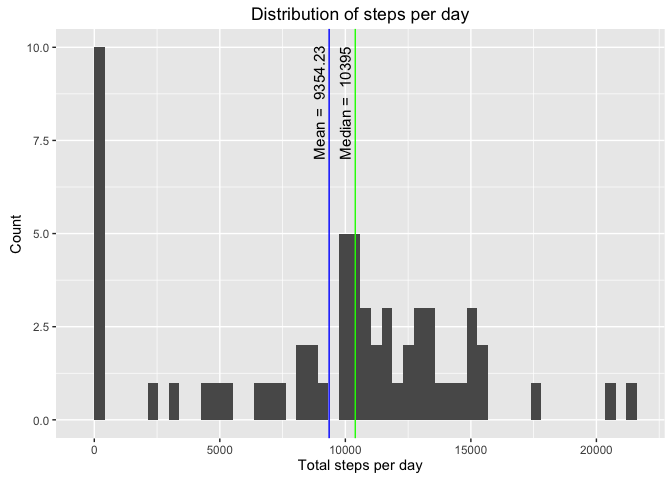
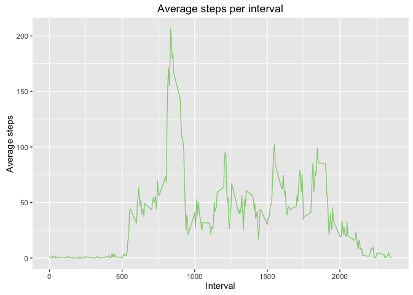
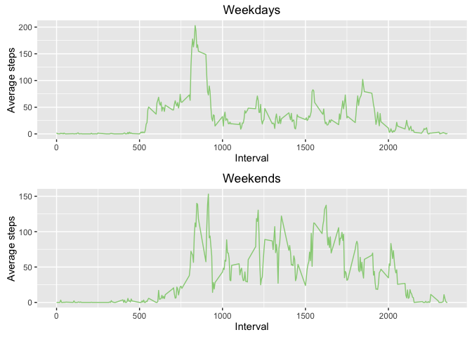

# Reproducible Research: Peer Assessment 1
## Loading and preprocessing the data

```r
activity <- read.csv("activity.csv")
activity$date <- as.Date(activity$date,"%Y-%m-%d")
```

## What is mean total number of steps taken per day?

Load libraries:

```r
library(plyr)
library(ggplot2)
library(gridExtra)
```

Aggregate data per day:

```r
dailyTotal <- function(data) {
  ddply(data,
        "date",
        summarise, 
        totalSteps = sum(steps, na.rm = TRUE))
}
perDay <- dailyTotal(activity)
```

Compute mean:

```r
meanSteps <- mean(perDay$totalSteps, na.rm = TRUE)
meanSteps
```

```
## [1] 9354.23
```

Compute median:

```r
medianSteps <- median(perDay$totalSteps, na.rm = TRUE)
medianSteps
```

```
## [1] 10395
```

Plot a histogram:

```r
plotHistogram <- function(data, mean, median) {
  qplot(data$totalSteps, 
        geom = "histogram", 
        bins = 50,
        main = "Distribution of steps per day",
        xlab = "Total steps per day",
        ylab = "Count") +
    geom_vline(xintercept = mean, colour = "blue") +
    geom_text(mapping=aes(x = mean,
                          y = 7,
                          label = paste("Mean = ", round(mean, digits = 2))),
              size = 4,
              angle = 90,
              vjust = -0.4,
              hjust = 0) + 
    geom_vline(xintercept = median, colour = "green") +
    geom_text(mapping=aes(x = median,
                          y = 7,
                          label = paste("Median = ", round(median, digits = 2))),
              size = 4,
              angle = 90,
              vjust = -0.4,
              hjust = 0)
}
plotHistogram(perDay, meanSteps, medianSteps)
```



## What is the average daily activity pattern?

Aggregate by intervals:

```r
meanForInterval <- function(data) {
  ddply(data, 
        "interval",
        summarise, 
        mean = mean(steps, na.rm = TRUE), total = sum(steps, na.rm = TRUE))
}
byInterval <- meanForInterval(activity)
```
Plot a time series:

```r
plotTimeSeries <- function(data, title) {
  ggplot(data = data, aes(x = interval, y = mean)) +
    geom_line(color = "#97CF84") +
    ggtitle(title) +
    xlab("Interval") +
    ylab("Average steps")
}
plotTimeSeries(byInterval, "Average steps per interval")
```



Find 5 minute interval with maximum number of steps on average:

```r
byInterval[which.max(byInterval$mean), ]
```

```
##     interval     mean total
## 104      835 206.1698 10927
```

## Imputing missing values

Calculate the total number of missing values in the dataset:


```r
missing <- subset(activity, is.na(steps) | is.na(date) | is.na(interval))
nrow(missing)
```

```
## [1] 2304
```

The approach employed in this assignment to impute values is to replace missing values with daily average.
Find daily average steps to help fill missing values:


```r
dailyMean <- ddply(activity,
                "date",
                summarise,
                meanSteps = mean(steps, na.rm = TRUE))
```
Replace mean steps with zero if they are not a number.


```r
dailyMean <- mutate(dailyMean, meanSteps = ifelse(is.nan(meanSteps),
                                                  0,
                                                  meanSteps))
```

Build a look up table for mean steps:


```r
means <- dailyMean$meanSteps
names(means) <- dailyMean$date
```

Replace missing values with daily mean:

```r
activity <- mutate(activity, steps = ifelse(is.na(steps),
                                            means[as.character(date)],
                                            steps))
```

Compute total steps per day after imputing:

```r
perDay <- dailyTotal(activity)
```

Compute mean:

```r
meanSteps <- mean(perDay$totalSteps, na.rm = TRUE)
meanSteps
```

```
## [1] 9354.23
```

Compute median:

```r
medianSteps <- median(perDay$totalSteps, na.rm = TRUE)
medianSteps
```

```
## [1] 10395
```

Create histogram:

```r
plotHistogram(perDay, meanSteps, medianSteps)
```


_There are no changes in `mean` or `median`._
_There is no impact of imputing on total number of steps per day._

## Are there differences in activity patterns between weekdays and weekends?

Add variable `type.of.day` indicating whether a given date is a weekday or weekend day:


```r
weekendDays <- c("Saturday", "Sunday")
activity <- mutate(activity, typeOfDay = ifelse(weekdays(date) %in% weekendDays,
                                                  "weekend",
                                                  "weekday"))
activity$typeOfDay = as.factor(activity$typeOfDay)
```

Aggregate by interval:

```r
weekDaysByInterval <- meanForInterval(subset(activity, typeOfDay == "weekday"))
weekEndsByInterval <- meanForInterval(subset(activity, typeOfDay == "weekend"))
```

Plot:

```r
p1 <- plotTimeSeries(weekDaysByInterval, "Weekdays")
p2 <- plotTimeSeries(weekEndsByInterval, "Weekends")
grid.arrange(p1, p2)
```



_There are differences in activity pattern between weekdays and weekends_
